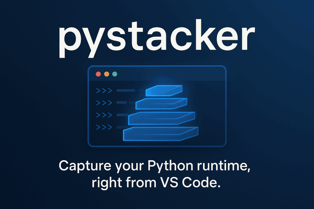

# PyStacker

<p align="center">
   <picture>
      <source srcset="media/pystacker-readme.webp" type="image/webp">
      
   </picture>
</p>

PyStacker is a VS Code extension that captures Python stack traces from a terminal using the bundled `py-spy` executable and displays results inside VS Code in an interactive webview.

## Features

✨ **Rich Interactive UI** - View stack traces in a structured webview with collapsible threads and frames (powered by a small Preact app bundled with esbuild)

🔍 **Smart Process Detection** - Automatically finds Python processes in terminal process trees, even nested under multiple shells

📊 **Multi-Process Support** - Capture stack traces from all Python processes at once or choose specific ones

🎨 **Flexible Output** - JSON output is shown in the interactive webview; text output opens in an editor window

🔧 **Configuration** - Control whether subprocesses and local variables are included, and choose the output format

## Platform Support

All commands work on **Windows, Linux, and macOS**! 🎉

## Commands

- Capture a stack trace from a Python process running in this terminal — right-click a terminal or use the command palette to run the capture for the active terminal. If one or more Python child processes are found, you'll be prompted to choose which to capture (or capture all).
- Refresh stack trace — when a webview is open you can refresh the capture for that PID (the webview provides a Refresh action which calls the extension command).

## Usage

### Quick Capture from Terminal Context Menu

1. Run Python in the terminal (for example `python sample.py` or an interactive REPL).
2. Capture using one of these:
   - Right-click the terminal and choose the PyStacker capture command
   - Use the Command Palette and run the capture command for the active terminal
3. If one or more Python child processes are detected you'll be prompted to choose a specific process or "Capture All Python Processes".
4. Results are shown inline:
   - JSON output is displayed in the interactive webview (preact app) with collapsible threads and frames, local variables (optional), and process metadata.
   - Non-JSON/text output is opened in an untitled text editor.

**Note:** The extension intelligently searches for Python processes in the terminal's process tree recursively, so it can find Python processes even when nested under multiple shells (e.g., PowerShell → bash → Python)!

### Manual Capture by PID

1. Open the Command Palette (Ctrl+Shift+P / Cmd+Shift+P)
2. Run the PyStacker capture command and enter the target process ID when prompted
3. If JSON output is produced the webview will open or update; otherwise the output text will open in an editor window

## Configuration

PyStacker provides several configuration options to customize the stack trace output:

### Output Format
- **Setting:** `pystacker.outputFormat`
- **Options:** `text` or `json` (default: `json`)
- **Description:** Controls the output format of stack traces. When `json` is selected the extension will render an interactive webview; when `text` is selected the raw text is opened in an editor.

### Include Subprocesses
- **Setting:** `pystacker.includeSubprocesses`
- **Default:** `false`
- **Description:** When enabled, py-spy will include stack traces from child processes spawned by the target Python process. Equivalent to the `--subprocesses` flag.

### Show Local Variables
- **Setting:** `pystacker.showLocalVariables`
- **Default:** `false`
- **Description:** When enabled, py-spy will display local variables in the stack trace. This can be helpful for debugging but produces more verbose output. Equivalent to the `--locals` flag.

### How to Configure

1. Open VS Code Settings (Ctrl+, / Cmd+,)
2. Search for "pystacker"
3. Adjust the settings as needed

Or add to your `settings.json`:
```json
{
  "pystacker.outputFormat": "json",
  "pystacker.includeSubprocesses": true,
  "pystacker.showLocalVariables": true
}
```


## Installation

This extension bundles a platform-specific `py-spy` executable in a `bin/` folder as part of the packaging/postinstall step. When installing from the Marketplace the correct package for your platform will be provided.

If installing from a VSIX file, download the package that matches your platform (the publisher's release artifacts provide platform-specific VSIX files).

### Development Setup

1. Clone or download this repository
2. Run `npm install` — the package.json `postinstall` script extracts the `py-spy` executable to `bin/` for local development and testing
3. Build the extension and webview bundle with `npm run build` (uses esbuild). For development you can run `npm run watch` to recompile on changes.
4. Press F5 in VS Code to launch the Extension Development Host

## How it works

The extension bundles the `py-spy` executable in a `bin/` directory. When you run a capture command the extension spawns the bundled `py-spy` binary with `dump --pid <pid>` and captures its stdout. JSON output is posted into the webview instead of being written to disk.

The interactive webview is a small Preact application bundled into `out/webview.js` by esbuild. Communication between the extension and the webview uses the VS Code webview messaging API: the webview posts a `ready` message and the extension replies with an `init` message containing the parsed thread dump.

This flow avoids embedding raw JSON in HTML and keeps the UI responsive for large thread dumps.


## Safety notes

- The extension launches the bundled `py-spy` executable to attach to running Python processes. Attaching to other users' processes or system processes may require elevated permissions and can be unsafe.
- On Windows you may need to run VS Code as Administrator to attach to some processes. On Linux/macOS you may need elevated privileges (sudo) for certain targets.
- Avoid running captures on untrusted or system-critical processes.


## Requirements

- **Build-time:** Python may be required by the project's `postinstall` helper script if building the py-spy extractor locally (see `scripts/setup-pystack.js`). For normal usage of published marketplace packages no system Python is required at runtime.

## Development

```powershell
npm install      # Install dependencies and extract the bundled py-spy executable (postinstall)
npm run build    # Build extension + webview bundle (esbuild)
npm run watch    # Optional: rebuild on changes during development
```

Press F5 in VS Code to launch the Extension Development Host.


## Testing

Sample test scripts are included in the `scripts/` directory. To try them:

```powershell
# Launch the sample multi-threaded Python program
./scripts/run-sample.ps1   # Windows PowerShell
```

Then use the terminal context menu or the Command Palette to capture a stack trace for the running Python process. The webview will open with the parsed thread dump when JSON output is produced.

See `scripts/README.md` for platform-specific launcher instructions.

